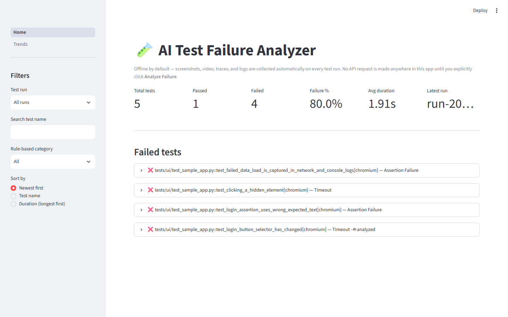
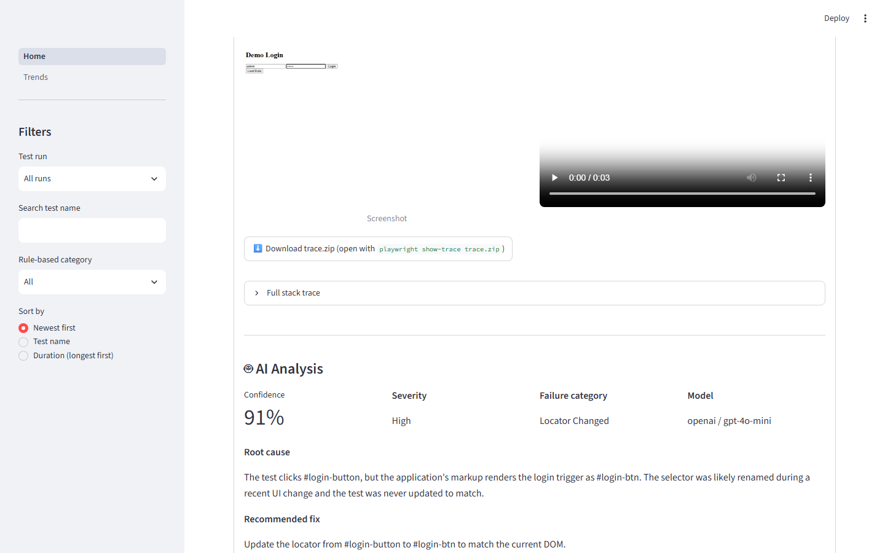
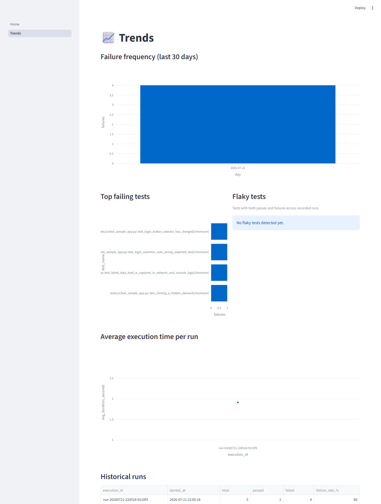

# 🧪 AI Test Failure Analyzer for Playwright

[](https://github.com/fastasf48-hash/AI-Test-Failure-Analyzer-For-Playwright/actions/workflows/ci.yml)


Every automated test failure comes with a pile of evidence — a screenshot, a
video, a trace, console logs, network logs, a stack trace — that a QA
engineer normally has to open one by one to figure out what actually went
wrong. This project collects all of it automatically, on every run, for
free, and adds one deliberate, explicit step where an LLM reads that
evidence and writes an actual debugging report: root cause, confidence,
severity, a concrete fix, and — when it applies — a better locator.

> **No API request is made anywhere in this project until you explicitly
> click "Analyze Failure" in the dashboard or run `python analyze_failure.py`.**
> Running tests, collecting artifacts, and browsing the dashboard all work
> completely offline. See [Security](#security).

---

## Screenshots

**Home — execution summary and failed tests**


**A failure, expanded — artifacts plus the AI report card**


**Trends — failure frequency, top failing tests, flaky tests, execution time**


---

## Features

- **Automatic failure collection** — screenshot, video, Playwright trace,
  browser console log, failed network requests, full stack trace, and an
  environment snapshot (OS, browser version, Python/Playwright version),
  captured on every failure with zero configuration.
- **Deterministic pre-AI classification** — a cheap, rule-based classifier
  (Timeout, Locator Changed, Assertion Failure, Network Failure, ...) runs on
  every failure at zero cost, so the dashboard is useful before you ever
  spend an API call.
- **Opt-in AI analysis** — one button, one CLI command. Structured JSON
  output (root cause, confidence score, severity, category, suggested fix,
  alternative fixes, improved locator, example code), validated against a
  Pydantic schema so a hallucinated category or an out-of-range confidence
  score is rejected before it reaches the database.
- **Pluggable LLM provider** — OpenAI (native structured outputs) or Claude
  (forced tool-use), switched with one `.env` variable. Adding a third
  provider means adding one class, not touching calling code.
- **Streamlit dashboard** — execution summary, searchable/filterable/sortable
  failed-tests list, per-failure detail view, trends (failure frequency, top
  failing tests, flaky tests, average duration per run).
- **pytest-html + Allure reports**, linked back to the database so a failed
  result knows which HTML report it appeared in.
- **GitHub Actions CI** that lints, tests, and generates both report types on
  every push — without ever spending an API token (see
  [Enabling AI analysis in CI](docs/enabling_ai_in_ci.md) for the fully
  opt-in alternative).

## Why this exists

Manually triaging a flaky or broken Playwright suite doesn't scale: someone
has to open the trace viewer, read the stack trace, check the console, and
guess whether it's a real bug, a stale locator, or a timing issue — for
every failure, every run. An LLM is genuinely useful here *because* it can
read all of that evidence at once and produce a specific, actionable
hypothesis — but only if it's grounded in the actual artifacts (not just a
test name) and only if a team can trust it isn't quietly burning API budget
in the background. Those two constraints — evidence-grounded prompts and
zero hidden API calls — shaped almost every design decision in this repo.

## Architecture

```
Playwright test fails
        │
        ▼
app/playwright fixtures capture screenshot, video, trace, console
log, network log, stack trace, environment  (see app/collectors/)
        │
        ▼
app/analyzers assembles a FailureBundle + a free, rule-based category
        │
        ▼
app/database persists the run + failure + artifact paths — no AI call yet
        │
        ▼
   dashboard / CLI: browse failures for free, any time
        │
        ▼
   you click "Analyze Failure"  ──►  app/llm calls the configured
                                      provider with an evidence-grounded
                                      prompt, validates the JSON response
        │
        ▼
app/database stores the AI report, linked to the failure
        │
        ▼
dashboard renders the AI report card
```

Layered so each part only depends on the layer below it: `collectors/` know
nothing about the database, `llm/` knows nothing about Playwright, and the
dashboard only ever *reads* except for the one button that calls `llm/`.
Full rationale for every folder, the database schema, and the two-phase
artifact-collection timing (screenshot/trace before `context.close()`, video
after) is in **[docs/architecture.md](docs/architecture.md)**.

### Folder structure

```
app/
├── config/        Typed Settings loaded from .env — one source of truth
├── utilities/     Logging, git metadata — no domain logic
├── playwright/    pytest hooks + the page fixture override (only place
│                  that touches pytest/Playwright hook APIs)
├── collectors/    One class per artifact type (SRP): screenshot, video,
│                  trace, console log, network log, stack trace, environment
├── analyzers/     Assembles collector output + rule-based classification;
│                  extracts the failing test's source via ast
├── llm/           Pluggable provider interface, prompts, Pydantic schema
├── database/      SQLAlchemy models + repository (all queries live here)
├── reports/       Links pytest-html/Allure output back to the database
└── dashboard/      Streamlit UI (Home + Trends pages, rendering helpers)

tests/
├── ui/            Sample Playwright tests — some fail on purpose, to
│                  exercise the pipeline and produce real demo artifacts
├── fixtures/      A tiny local demo page served over loopback HTTP
└── test_*.py      Unit tests for every non-UI module

analyze_failure.py   CLI entrypoint — the only other place that can call an LLM
docs/                Architecture deep-dive + CI/AI opt-in guide
assets/screenshots/  README images
.github/workflows/   Main CI (never touches AI) + an opt-in manual AI workflow
```

## Failure categories

`Locator Changed` · `Timeout` · `Assertion Failure` · `API Failure` ·
`Authentication Failure` · `Network Failure` · `Environment Issue` ·
`Database Failure` · `JavaScript Exception` · `Flaky Test` · `Slow Backend` ·
`Element Hidden` · `Incorrect Wait Strategy` · `Incorrect Assertion` ·
`Test Data Issue` · `Unknown`

The rule-based classifier picks one of these for free on every failure; the
AI analysis (when you request it) reasons from the actual evidence and can
override it.

## Tech stack

| Layer | Choice | Why |
|---|---|---|
| Browser automation | Playwright + pytest-playwright | Industry-standard, first-class Python API, built-in tracing/video |
| Test runner | pytest | Hook system (`pytest_runtest_makereport`, `pytest_sessionfinish`) is exactly what failure collection needs |
| Database | SQLite + SQLAlchemy 2.0 | Zero setup for a single-user portfolio tool; typed models via `Mapped[...]`; swappable for Postgres later without touching calling code |
| Dashboard | Streamlit | Fastest path from a Python data layer to an interactive UI — no separate frontend build |
| LLM SDKs | `openai`, `anthropic` | Both official SDKs, used through one interface (`app/llm/base_provider.py`) |
| Schema validation | Pydantic | Same model generates the JSON schema handed to the LLM *and* validates its response |
| Lint/format | Ruff + Black | Fast, minimal-config, standard for modern Python |

## Setup

### Prerequisites

- Python 3.11+
- Node.js (optional — only needed to generate the interactive Allure HTML
  report locally via `npm install -g allure-commandline`)

### Installation

```bash
git clone https://github.com/fastasf48-hash/AI-Test-Failure-Analyzer-For-Playwright.git
cd AI-Test-Failure-Analyzer-For-Playwright

python -m venv .venv
# Windows
.venv\Scripts\activate
# macOS/Linux
source .venv/bin/activate

pip install -r requirements.txt
playwright install chromium
```

### Configuration

```bash
cp .env.example .env
```

| Variable | Required | Description |
|---|---|---|
| `LLM_PROVIDER` | No (default `openai`) | `openai` or `claude` |
| `OPENAI_API_KEY` | Only if using OpenAI | Your OpenAI API key |
| `CLAUDE_API_KEY` | Only if using Claude | Your Anthropic API key |
| `OPENAI_MODEL` | No (default `gpt-4o-mini`) | Override the OpenAI model |
| `CLAUDE_MODEL` | No (default `claude-sonnet-5`) | Override the Claude model |
| `DATABASE_URL` | No | Defaults to a local SQLite file under `data/` |
| `ARTIFACTS_DIR` | No | Defaults to `data/artifacts/` |
| `LOG_LEVEL` | No (default `INFO`) | `DEBUG` / `INFO` / `WARNING` / `ERROR` |

If no key is configured for the active provider, the dashboard's Analyze
button and `analyze_failure.py` both show a friendly message and exit —
never a stack trace, and never a network request.

## Usage

**Run the sample suite** (a few tests fail on purpose, to populate the
dashboard with real artifacts):

```bash
pytest tests/ --browser chromium
```

**Browse the dashboard:**

```bash
streamlit run app/dashboard/Home.py
```

**Analyze a failure** (the only commands that spend an API call):

```bash
python analyze_failure.py --list        # see recorded failures, no API call
python analyze_failure.py --latest      # analyze the most recent failure
python analyze_failure.py --id 42       # analyze a specific one
```

**Generate reports:**

```bash
pytest tests/ --browser chromium \
  --html=reports/pytest-report.html --self-contained-html \
  --alluredir=allure-results

# Optional — renders allure-results/ into an interactive site (needs the
# Allure commandline: npm install -g allure-commandline)
python -c "from pathlib import Path; from app.reports.allure_linker import generate_allure_report; generate_allure_report(Path('allure-results'), Path('allure-report'))"
```

**Lint/format** (also run in CI):

```bash
ruff check app tests analyze_failure.py
black --check app tests analyze_failure.py
```

## 🔒 Security

- **No hidden API calls.** Nothing in this repo calls OpenAI or Claude except
  `analyze_failure.py` and the dashboard's "Analyze Failure" button — both
  are explicit, user-initiated actions. CI never calls an LLM (see
  [docs/enabling_ai_in_ci.md](docs/enabling_ai_in_ci.md) for the fully
  opt-in alternative).
- **No hardcoded credentials.** Keys are read from `.env` (gitignored) via
  `app/config/settings.py`; `.env.example` documents every variable with no
  real values.
- **Graceful missing-key handling.** A missing key raises a typed
  `MissingAPIKeyError` caught before any provider client is constructed —
  the dashboard shows a warning, the CLI prints a message and exits 1.
- **Structured-output validation is the actual safety mechanism**, not just
  prompt wording: the LLM's response is parsed into a Pydantic model
  (`app/llm/schemas.py`), so an invented category or an out-of-range
  confidence score is rejected before it reaches the database.

## Future improvements

- Postgres support for multi-user/team deployments (the repository layer
  already abstracts the engine; only `DATABASE_URL` would change).
- Per-analysis cost/token tracking, surfaced in the dashboard.
- A `Dockerfile` / `docker-compose.yml` for one-command local setup.
- Multi-browser CI matrix (Firefox, WebKit) alongside Chromium.
- Authentication on the dashboard for shared/team deployments.
- Slack/Teams notification on new AI analysis results.

## Troubleshooting

| Problem | Fix |
|---|---|
| `playwright._impl._errors.Error: Executable doesn't exist` | Run `playwright install chromium` |
| Dashboard shows no failures | Run `pytest tests/ --browser chromium` first to populate `data/analyzer.db` |
| "No API key configured" | Add `OPENAI_API_KEY` or `CLAUDE_API_KEY` to `.env`, matching `LLM_PROVIDER` |
| Allure HTML generation logs a warning and skips | Install the Allure commandline: `npm install -g allure-commandline` (needs Java) |
| Streamlit says the port is already in use | Another instance is running — stop it, or run with `--server.port 8502` |
| Windows: Allure command not found even though installed | npm installs `allure` as a `.cmd` shim; this project already runs it via a shell on Windows (`app/reports/allure_linker.py`) — make sure `npm`'s global bin directory is on `PATH` |

## Contributing

1. Fork and create a feature branch.
2. Make your change; add or update tests.
3. Before opening a PR: `ruff check app tests analyze_failure.py`, `black --check app tests analyze_failure.py`, `pytest tests/ --ignore=tests/ui`.
4. Open a PR describing what changed and why.

## License

MIT — see [LICENSE](LICENSE).
